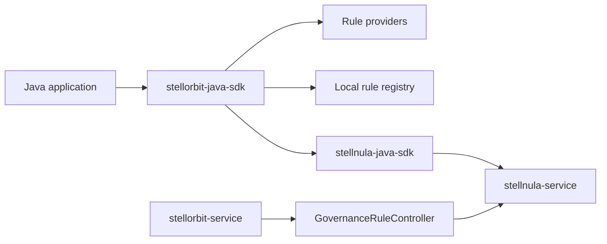

# StellOrbit Java SDK

[English](README.md) | [Chinese](README.zh-CN.md)

`stellorbit-java-sdk` is the Java client SDK for
[`stellhub/stellorbit-service`](https://github.com/stellhub/stellorbit-service).
It consumes service governance rules from
[`stellnula-service`](https://github.com/stellhub/stellnula-service) through
[`stellnula-java-sdk`](https://github.com/stellhub/stellnula-java-sdk), builds a
local immutable rule registry, and exposes strongly typed rule providers for
route, circuit breaker, authorization, and rate limit integrations.

The core SDK is intentionally a rule data-plane client. It does not implement a
circuit breaker state machine, a rate limit algorithm, an authorization
interceptor, or a routing engine. Those runtime behaviors belong in framework
adapters and Spring Boot starters.

## Architecture



`stellorbit-service` remains the control plane and rule producer. It publishes
governance rules to StellNula. This SDK subscribes to the governance rule channel,
parses rule content, keeps the last known good registry, and lets application
integrations query matching rules locally.

## Rule Channel

The SDK subscribes to the StellNula configuration channel used by the governance
control plane:

| Field | Value |
| --- | --- |
| `namespace` | `governance` |
| `group` | `service-governance` |
| `format` | `json` |

The default `StellorbitClientOptions` values keep `ruleNamespace=governance` and
`ruleGroup=service-governance`. They remain configurable mainly for tests and
local experiments.

## Capabilities

- Bootstrap governance rules from StellNula at startup.
- Watch rule changes through the StellNula client and atomically replace the
  local registry.
- Cache route, circuit breaker, authorization, rate limit, and degrade rules as
  immutable rule objects.
- Expose typed providers:
  - `RouteRuleProvider`
  - `CircuitBreakerRuleProvider`
  - `AuthorizationRuleProvider`
  - `RateLimitRuleProvider`
- Match rules by `targetService`, `status`, `priority`, and top-level
  `conditions`.
- Preserve last known good rule content when a single rule update is invalid.
- Remove deleted StellNula entries from the local registry.
- Keep the legacy HTTP client for existing StellOrbit management or compatibility
  calls.

## Non Goals

The core SDK does not depend on Resilience4j, Bucket4j, Spring Security, Servlet
API, Spring MVC, WebFlux, Feign, or Gateway. It also does not create, update, or
delete governance rules through the control plane.

Framework-level integrations should use this SDK as the rule source and provide
their own runtime adapters, for example Spring MVC interceptors, WebClient
filters, Feign interceptors, Gateway filters, Spring Security authorization
hooks, Resilience4j circuit breakers, or Bucket4j rate limiters.

## Requirements

| Item | Value |
| --- | --- |
| Java | 25 or later |
| Build tool | Maven |
| Rule source | `stellnula-service` |
| Rule producer | `stellorbit-service` |
| Core package | `io.github.stellorbit` |
| Maven group | `io.github.stellhub` |

Java 25 is currently required because the SDK depends on the published
`stellnula-java-sdk` baseline. Supporting Java 17 consumers later requires a Java
17-compatible `stellnula-java-sdk` release first.

## Installation

```xml
<dependency>
    <groupId>io.github.stellhub</groupId>
    <artifactId>stellorbit-java-sdk</artifactId>
    <version>0.0.1</version>
</dependency>
```

## Quick Start

```java
package example;

import io.github.stellorbit.client.DefaultStellorbitClient;
import io.github.stellorbit.client.StellorbitClient;
import io.github.stellorbit.client.StellorbitClientOptions;
import io.github.stellorbit.client.model.AuthorizationRuleQuery;
import io.github.stellorbit.client.model.CircuitBreakerRuleQuery;
import io.github.stellorbit.client.model.RateLimitRuleQuery;
import io.github.stellorbit.client.model.RequestContext;
import io.github.stellorbit.client.model.RouteRuleQuery;
import io.github.stellorbit.client.rule.GovernanceRule;
import java.net.URI;
import java.util.List;
import java.util.Map;
import java.util.Set;

public class StellorbitExample {

    public static void main(String[] args) {
        StellorbitClientOptions options = StellorbitClientOptions.builder()
                .stellnulaEndpoint(URI.create("http://localhost:8060"))
                .appId("payment-service")
                .clientId("payment-service-local-1")
                .env("dev")
                .region("default")
                .zone("default")
                .cluster("default")
                .build();

        try (StellorbitClient client = new DefaultStellorbitClient(options)) {
            client.start();

            RequestContext context = RequestContext.builder()
                    .tenantId("tenant-a")
                    .quotaKey("tenant-a")
                    .trafficTag("gray")
                    .attributes(Map.of("env", "dev"))
                    .build();

            List<GovernanceRule> routeRules = client.routes().find(new RouteRuleQuery(
                    "payment-service",
                    "tenant-a",
                    Map.of("env", "dev"),
                    context));

            List<GovernanceRule> authRules = client.authorizations().find(new AuthorizationRuleQuery(
                    "payment-service",
                    "alice",
                    "tenant-a",
                    Set.of("payment-admin"),
                    null,
                    context));

            List<GovernanceRule> rateLimitRules = client.rateLimits().find(new RateLimitRuleQuery(
                    "payment-service",
                    "tenant-a",
                    context));

            List<GovernanceRule> circuitBreakerRules = client.circuitBreakers().find(new CircuitBreakerRuleQuery(
                    "payment-service",
                    "create-order",
                    context));

            System.out.println(routeRules);
            System.out.println(authRules);
            System.out.println(rateLimitRules);
            System.out.println(circuitBreakerRules);
        }
    }
}
```

## Client Options

| Option | Default | Description |
| --- | --- | --- |
| `stellnulaEndpoint` | none | StellNula HTTP endpoint. Required for the rule source. |
| `stellnulaGrpcEndpoint` | service-provided | Optional StellNula gRPC Watch endpoint. |
| `stellnulaGrpcPlaintext` | `true` | Whether gRPC Watch uses plaintext transport. |
| `stellnulaApiToken` | empty | StellNula API token. |
| `appId` | `stellorbit-java-sdk` | Current application identifier. |
| `clientId` | generated UUID | Current SDK instance identifier. |
| `env` | `dev` | Environment scope. |
| `region` | `default` | Region scope. |
| `zone` | `default` | Zone scope. |
| `cluster` | `default` | Cluster scope. |
| `ruleNamespace` | `governance` | Governance rule namespace. |
| `ruleGroup` | `service-governance` | Governance rule group. |
| `watchEnabled` | `true` | Whether to subscribe to rule changes. |
| `failFastOnBootstrap` | `false` | Whether startup should fail when bootstrap fails. |
| `snapshotDirectory` | StellNula default | Local snapshot directory. |

`endpoint`, `apiKey`, `connectTimeout`, and `requestTimeout` are retained for the
legacy `StellorbitHttpClient` path.

## API Surface

| API | Responsibility |
| --- | --- |
| `StellorbitClient.start()` | Start StellNula bootstrap and watch. |
| `StellorbitClient.routes()` | Return `RouteRuleProvider`. |
| `StellorbitClient.circuitBreakers()` | Return `CircuitBreakerRuleProvider`. |
| `StellorbitClient.authorizations()` | Return `AuthorizationRuleProvider`. |
| `StellorbitClient.rateLimits()` | Return `RateLimitRuleProvider`. |
| `StellorbitClient.rules()` | Return the current immutable `GovernanceRuleRegistry`. |

Providers return active rules ordered by priority ascending, revision descending,
and rule id ascending.

`RateLimitRuleProvider` understands the enterprise rate limit contract at the
rule-data level. `RateLimitRuleQuery` can filter by `limitMode`, `limitType`,
`trafficProtocol`, `executionLocation`, `coordinationMode`, and
`keyExtractor.keys.source`. The provider also exposes `distributed()`,
`localRuntime()`, `httpHeader()`, and `grpcMetadata()` helpers, while
`RateLimitRules` exposes stable field readers such as `isDistributedRule()` and
`limitMode()`. These APIs only classify and expose rules; they do not execute
token buckets, concurrency leases, custom policies, or model limiters.

## Rule Format

`stellorbit-service` publishes fixed type-level StellNula configs. The `configId`
is stable for each application and rule type, for example
`stellorbit.payment-service.route`. Each config value is an aggregate payload
that contains release metadata, a typed validator payload, and a `rules` array.

The SDK requires this aggregate schema and expands `rules[]` into individual
local `GovernanceRule` objects.

```json
{
  "schemaVersion": "stellorbit.governance.aggregate.v1",
  "releaseVersion": 7,
  "applicationCode": "payment-service",
  "configId": "stellorbit.payment-service.route",
  "ruleType": "ROUTE",
  "targetService": "payment-service",
  "status": "ACTIVE",
  "priority": 10,
  "ruleCount": 1,
  "rules": [
    {
      "ruleId": "route-a",
      "ruleCode": "route-a",
      "ruleName": "Route A",
      "targetService": "payment-service",
      "status": "ACTIVE",
      "priority": 10,
      "content": {
        "ruleType": "ROUTE",
        "targetService": "payment-service",
        "status": "ACTIVE",
        "priority": 10,
        "conditions": {
          "trafficTag": "gray"
        },
        "routes": [
          {
            "target": "payment-service-gray",
            "weight": 100
          }
        ]
      }
    }
  ],
  "routes": [
    [
      {
        "target": "payment-service-gray",
        "weight": 100
      }
    ]
  ],
  "checksum": "aggregate-checksum"
}
```

Supported local rule types:

| Rule type | Required payload |
| --- | --- |
| `ROUTE` | `routes` |
| `CIRCUIT_BREAKER` | `breaker` |
| `RATE_LIMIT` | `limit` |
| `AUTH` | `auth` |
| `DEGRADE` | `degrade` |

The matcher supports scalar values, collections, and these map operators:

| Operator | Meaning |
| --- | --- |
| `exists` | Attribute must be present or absent. |
| `equals` | Attribute must equal the expected value. |
| `notEquals` | Attribute must not equal the expected value. |
| `in` | Attribute must match one value from the expected collection. |

Multi-value query attributes are comma-separated internally, so role-based
authorization conditions can match any requested role.

## Authorization Rule Compatibility

This SDK already exposes `AuthorizationRuleProvider` and can parse local `AUTH`
rules. Publishing `AUTH` rules through the current control plane also requires
`stellnula-service` to accept `AUTH` in its governance rule validator. If the
service validator still only accepts `ROUTE`, `RATE_LIMIT`, `CIRCUIT_BREAKER`,
and `DEGRADE`, upgrade the service before enabling the auth starter.

## Spring Boot Starter Plan

The core SDK stays Spring-free. Spring Boot integration should be split by
capability:

| Starter | Responsibility |
| --- | --- |
| `stellorbit-spring-boot-starter-route` | Route provider plus routing interceptors or adapters. |
| `stellorbit-spring-boot-starter-circuit-breaker` | Circuit breaker provider plus Resilience4j adapter. |
| `stellorbit-spring-boot-starter-auth` | Authorization provider plus Spring Security or interceptor adapter. |
| `stellorbit-spring-boot-starter-rate-limit` | Rate limit provider plus Bucket4j or Resilience4j adapter. |

An aggregate starter can be added later as a dependency bundle over the four
focused starters.

## Legacy HTTP Client

`StellorbitHttpClient` implements `StellorbitRemoteClient` and is retained for
existing remote HTTP calls:

| Method | Responsibility |
| --- | --- |
| `route(RouteRequest request)` | Request a route decision from StellOrbit. |
| `lifecyclePolicy(String serviceName)` | Fetch service lifecycle governance policy. |
| `trafficPolicy(String serviceName)` | Fetch traffic governance policy. |

New data-plane integrations should use `DefaultStellorbitClient`.

## Development

Run tests:

```bash
mvn test
```

Verify release packaging without signing:

```bash
mvn -Prelease -DskipTests "-Dgpg.skip=true" verify
```

## Documentation

- [Architecture decision record](docs/ADR.md)
- [Chinese README](README.zh-CN.md)
- [stellorbit-service](https://github.com/stellhub/stellorbit-service)
- [stellnula-service](https://github.com/stellhub/stellnula-service)
- [stellnula-java-sdk](https://github.com/stellhub/stellnula-java-sdk)

## License

Apache License 2.0.
