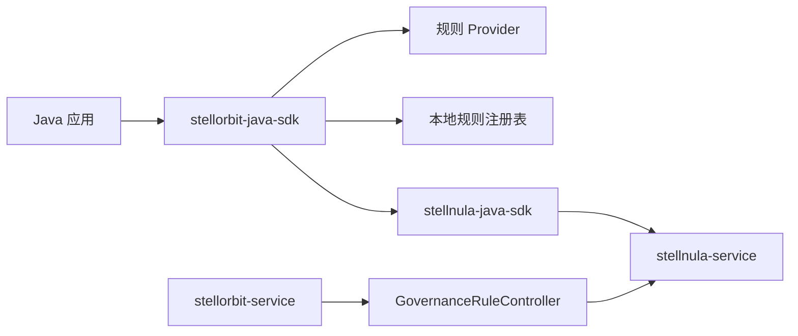

# StellOrbit Java SDK

[English](README.md) | [中文](README.zh-CN.md)

`stellorbit-java-sdk` 是
[`stellhub/stellorbit-service`](https://github.com/stellhub/stellorbit-service)
的 Java 客户端 SDK。它通过
[`stellnula-java-sdk`](https://github.com/stellhub/stellnula-java-sdk) 从
[`stellnula-service`](https://github.com/stellhub/stellnula-service) 消费服务治理规则，在本地构建不可变规则注册表，并向路由、熔断、鉴权、限流等接入层暴露强类型规则 Provider。

核心 SDK 的定位是治理规则数据面客户端。它不实现熔断状态机、限流算法、鉴权拦截器或路由执行引擎。这些运行时能力应该放在框架适配层和 Spring Boot Starter 中完成。

## 架构



`stellorbit-service` 仍然是治理规则的控制面和生产者，负责将规则发布到 StellNula。当前 SDK 订阅治理规则通道，解析规则内容，维护 last-known-good 规则注册表，并允许应用接入层在本地查询匹配规则。

## 规则通道

SDK 订阅控制面约定的 StellNula 配置通道：

| 字段 | 值 |
| --- | --- |
| `namespace` | `governance` |
| `group` | `service-governance` |
| `format` | `json` |

`StellorbitClientOptions` 默认保持 `ruleNamespace=governance` 与
`ruleGroup=service-governance`。这两个字段保留为可配置项，主要用于测试和本地实验。

## 能力

- 启动时从 StellNula bootstrap 治理规则。
- 通过 StellNula 客户端 watch 规则变化，并原子替换本地注册表。
- 将路由、熔断、鉴权、限流、降级规则缓存为不可变规则对象。
- 暴露强类型 Provider：
  - `RouteRuleProvider`
  - `CircuitBreakerRuleProvider`
  - `AuthorizationRuleProvider`
  - `RateLimitRuleProvider`
- 根据 `targetService`、`status`、`priority` 和顶层 `conditions` 匹配规则。
- 单条规则更新非法时保留上一版可用内容。
- StellNula 配置被删除时从本地注册表移除对应规则。
- 保留旧 HTTP 客户端，用于已有 StellOrbit 管理接口或兼容调用。

## 非目标

核心 SDK 不依赖 Resilience4j、Bucket4j、Spring Security、Servlet API、Spring MVC、WebFlux、Feign 或 Gateway。它也不通过控制面创建、更新或删除治理规则。

框架层集成应该把当前 SDK 作为规则来源，并自行提供运行时适配，例如 Spring MVC 拦截器、WebClient Filter、Feign Interceptor、Gateway Filter、Spring Security 鉴权钩子、Resilience4j 熔断器或 Bucket4j 限流器。

## 环境要求

| 项目 | 值 |
| --- | --- |
| Java | 25 或更高版本 |
| 构建工具 | Maven |
| 规则来源 | `stellnula-service` |
| 规则生产者 | `stellorbit-service` |
| 核心包名 | `io.github.stellorbit` |
| Maven group | `io.github.stellhub` |

当前需要 Java 25，是因为 SDK 依赖的 `stellnula-java-sdk` 发布基线为 Java 25。后续如果要重新支持 Java 17 消费者，需要先推动 `stellnula-java-sdk` 发布 Java 17 兼容版本。

## 安装

```xml
<dependency>
    <groupId>io.github.stellhub</groupId>
    <artifactId>stellorbit-java-sdk</artifactId>
    <version>0.0.1</version>
</dependency>
```

## 快速开始

```java
package example;

import io.github.stellorbit.client.DefaultStellorbitClient;
import io.github.stellorbit.client.StellorbitClient;
import io.github.stellorbit.client.StellorbitClientOptions;
import io.github.stellorbit.client.model.AuthorizationRuleQuery;
import io.github.stellorbit.client.model.CircuitBreakerRuleQuery;
import io.github.stellorbit.client.model.RateLimitRuleQuery;
import io.github.stellorbit.client.model.RequestContext;
import io.github.stellorbit.client.model.RouteRuleQuery;
import io.github.stellorbit.client.rule.GovernanceRule;
import java.net.URI;
import java.util.List;
import java.util.Map;
import java.util.Set;

public class StellorbitExample {

    public static void main(String[] args) {
        StellorbitClientOptions options = StellorbitClientOptions.builder()
                .stellnulaEndpoint(URI.create("http://localhost:8060"))
                .appId("payment-service")
                .clientId("payment-service-local-1")
                .env("dev")
                .region("default")
                .zone("default")
                .cluster("default")
                .build();

        try (StellorbitClient client = new DefaultStellorbitClient(options)) {
            client.start();

            RequestContext context = RequestContext.builder()
                    .tenantId("tenant-a")
                    .quotaKey("tenant-a")
                    .trafficTag("gray")
                    .attributes(Map.of("env", "dev"))
                    .build();

            List<GovernanceRule> routeRules = client.routes().find(new RouteRuleQuery(
                    "payment-service",
                    "tenant-a",
                    Map.of("env", "dev"),
                    context));

            List<GovernanceRule> authRules = client.authorizations().find(new AuthorizationRuleQuery(
                    "payment-service",
                    "alice",
                    "tenant-a",
                    Set.of("payment-admin"),
                    null,
                    context));

            List<GovernanceRule> rateLimitRules = client.rateLimits().find(new RateLimitRuleQuery(
                    "payment-service",
                    "tenant-a",
                    context));

            List<GovernanceRule> circuitBreakerRules = client.circuitBreakers().find(new CircuitBreakerRuleQuery(
                    "payment-service",
                    "create-order",
                    context));

            System.out.println(routeRules);
            System.out.println(authRules);
            System.out.println(rateLimitRules);
            System.out.println(circuitBreakerRules);
        }
    }
}
```

## 客户端配置

| 配置项 | 默认值 | 说明 |
| --- | --- | --- |
| `stellnulaEndpoint` | 无 | StellNula HTTP 地址。规则源必填。 |
| `stellnulaGrpcEndpoint` | 服务端返回 | 可选的 StellNula gRPC Watch 地址。 |
| `stellnulaGrpcPlaintext` | `true` | gRPC Watch 是否使用明文传输。 |
| `stellnulaApiToken` | 空 | StellNula API Token。 |
| `appId` | `stellorbit-java-sdk` | 当前应用标识。 |
| `clientId` | 生成的 UUID | 当前 SDK 实例标识。 |
| `env` | `dev` | 环境范围。 |
| `region` | `default` | 区域范围。 |
| `zone` | `default` | 可用区范围。 |
| `cluster` | `default` | 集群范围。 |
| `ruleNamespace` | `governance` | 治理规则 namespace。 |
| `ruleGroup` | `service-governance` | 治理规则 group。 |
| `watchEnabled` | `true` | 是否订阅规则变化。 |
| `failFastOnBootstrap` | `false` | 启动同步失败时是否快速失败。 |
| `snapshotDirectory` | StellNula 默认值 | 本地快照目录。 |

`endpoint`、`apiKey`、`connectTimeout` 和 `requestTimeout` 保留给旧
`StellorbitHttpClient` 路径使用。

## API 表面

| API | 职责 |
| --- | --- |
| `StellorbitClient.start()` | 启动 StellNula bootstrap 和 watch。 |
| `StellorbitClient.routes()` | 返回 `RouteRuleProvider`。 |
| `StellorbitClient.circuitBreakers()` | 返回 `CircuitBreakerRuleProvider`。 |
| `StellorbitClient.authorizations()` | 返回 `AuthorizationRuleProvider`。 |
| `StellorbitClient.rateLimits()` | 返回 `RateLimitRuleProvider`。 |
| `StellorbitClient.rules()` | 返回当前不可变 `GovernanceRuleRegistry`。 |

Provider 只返回启用状态的规则，并按 priority 升序、revision 降序、rule id 升序排序。

## 规则格式

每个 StellNula 配置项包含一条 JSON 治理规则。解析器要求规则具备统一 envelope，并包含对应规则类型的 payload。

```json
{
  "ruleName": "payment-gray-route",
  "ruleType": "ROUTE",
  "targetService": "payment-service",
  "status": "ACTIVE",
  "priority": 10,
  "conditions": {
    "tenantId": {
      "in": ["tenant-a", "tenant-b"]
    },
    "trafficTag": "gray"
  },
  "routes": [
    {
      "target": "payment-service-gray",
      "weight": 100
    }
  ]
}
```

本地支持的规则类型：

| 规则类型 | 必填 payload |
| --- | --- |
| `ROUTE` | `routes` |
| `CIRCUIT_BREAKER` | `breaker` |
| `RATE_LIMIT` | `limit` |
| `AUTH` | `auth` |
| `DEGRADE` | `degrade` |

匹配器支持标量值、集合值和以下 map 操作符：

| 操作符 | 含义 |
| --- | --- |
| `exists` | 属性必须存在或不存在。 |
| `equals` | 属性必须等于预期值。 |
| `notEquals` | 属性必须不等于预期值。 |
| `in` | 属性必须命中预期集合中的某个值。 |

多值查询属性在内部使用逗号分隔，因此鉴权规则可以匹配请求角色集合中的任意角色。

## 鉴权规则兼容性

当前 SDK 已经暴露 `AuthorizationRuleProvider`，并支持解析本地 `AUTH` 规则。若要通过当前控制面发布 `AUTH` 规则，还需要 `stellnula-service` 的治理规则 validator 接受 `AUTH`。如果服务端 validator 仍只接受 `ROUTE`、`RATE_LIMIT`、`CIRCUIT_BREAKER` 和 `DEGRADE`，需要先升级服务端，再启用鉴权 starter。

## Spring Boot Starter 规划

核心 SDK 保持无 Spring 依赖。Spring Boot 接入后续按治理能力拆分：

| Starter | 职责 |
| --- | --- |
| `stellorbit-spring-boot-starter-route` | 路由规则 Provider 与路由拦截器或适配器。 |
| `stellorbit-spring-boot-starter-circuit-breaker` | 熔断规则 Provider 与 Resilience4j 适配。 |
| `stellorbit-spring-boot-starter-auth` | 鉴权规则 Provider 与 Spring Security 或拦截器适配。 |
| `stellorbit-spring-boot-starter-rate-limit` | 限流规则 Provider 与 Bucket4j 或 Resilience4j 适配。 |

后续可以再增加聚合 starter，作为上述四个独立 starter 的依赖聚合层。

## 旧 HTTP 客户端

`StellorbitHttpClient` 实现 `StellorbitRemoteClient`，用于保留已有远程 HTTP 调用：

| 方法 | 职责 |
| --- | --- |
| `route(RouteRequest request)` | 请求 StellOrbit 服务端路由决策。 |
| `lifecyclePolicy(String serviceName)` | 查询指定服务的生命周期治理策略。 |
| `trafficPolicy(String serviceName)` | 查询指定服务的流量治理策略。 |

新的数据面接入应该使用 `DefaultStellorbitClient`。

## 开发

运行测试：

```bash
mvn test
```

在不签名的情况下验证 release 打包：

```bash
mvn -Prelease -DskipTests "-Dgpg.skip=true" verify
```

## 文档

- [架构决策记录](docs/ADR.md)
- [英文 README](README.md)
- [stellorbit-service](https://github.com/stellhub/stellorbit-service)
- [stellnula-service](https://github.com/stellhub/stellnula-service)
- [stellnula-java-sdk](https://github.com/stellhub/stellnula-java-sdk)

## License

Apache License 2.0.
