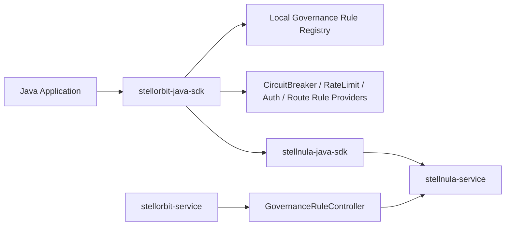

# ADR-0001: 基于 StellNula 配置中心接入 StellOrbit 服务治理规则

## 状态

已接受，实施中。

## 日期

2026-06-17

## 问题分析

`stellorbit-java-sdk` 是 `stellhub/stellorbit-service` 的 Java SDK，目标是在 Java 应用侧消费服务治理能力，包括熔断、限流、鉴权和路由规则。当前仓库仍以直接访问 `stellorbit-service` HTTP API 为主，缺少一个面向数据面的本地规则订阅、缓存、解析和热更新底座。

服务治理规则的控制面事实源不应由 SDK 直接维护。`stellorbit-service` 负责生成、校验和发布治理规则，并通过 `stellnula-service` 的 `GovernanceRuleController` 将规则写入配置中心。该控制器已经固定治理规则的配置坐标：

- `namespace`: `governance`
- `group`: `service-governance`
- `format`: `json`
- `contentType`: 默认 `FILE`
- `operator`: `service-governance-data-plane`

因此，Java SDK 的规则下发链路应以 `stellnula-java-sdk` 为底座，通过初始化一个指向 `stellnula-service` 的配置中心客户端来完成启动同步、快照读取、gRPC Watch、变更监听和故障恢复，而不是在 SDK 内部重新实现配置中心协议。

## 决策

`stellorbit-java-sdk` 将引入 `io.github.stellhub:stellnula-java-sdk`，并以 StellNula 配置中心作为服务治理规则的数据面下发通道。

SDK 启动时会构建一个专用于治理规则的 `StellnulaClient`：

```java
StellnulaClientOptions options = StellnulaClientOptions.builder()
        .endpoint(stellnulaEndpoint)
        .apiToken(apiToken)
        .appId(appId)
        .clientId(clientId)
        .env(env)
        .region(region)
        .zone(zone)
        .cluster(cluster)
        .namespace("governance")
        .group("service-governance")
        .watchEnabled(true)
        .build();
```

该客户端负责：

- 启动时执行远端 bootstrap，同步当前环境、区域、可用区、集群范围内的治理规则。
- 将远端规则保存为 StellNula 内存快照和本地目录快照。
- 通过 gRPC Watch 监听 revision 变化。
- 在 Watch 异常时使用 StellNula SDK 自带的 HTTP delta/full sync 补偿。
- 通过 listener 将配置变更转换为 SDK 内部的规则注册表更新事件。

## 设计

### 架构边界



`stellorbit-service` 仍是治理规则的生产者和控制面入口；`stellnula-service` 是规则下发和 watch 的基础设施；`stellorbit-java-sdk` 是规则消费者、缓存层和规则 Provider，不承担具体熔断、限流、鉴权或路由执行引擎职责。

SDK 核心模块保持纯 Java 客户端定位，不在核心模块中引入 Spring Boot 自动装配。后续如果需要 Spring Boot Starter，应在独立模块中包装 `StellorbitClientOptions`、`StellnulaClientOptions` 和生命周期管理。

### Spring Boot Starter 拆分

Spring Boot 接入不做单一大而全 starter，后续按治理能力拆成四个独立入口：

| Starter | 能力边界 |
| --- | --- |
| `stellorbit-spring-boot-starter-route` | 自动装配路由规则 Provider 与框架路由适配 |
| `stellorbit-spring-boot-starter-circuit-breaker` | 自动装配熔断规则 Provider 与 Resilience4j 等适配 |
| `stellorbit-spring-boot-starter-auth` | 自动装配鉴权规则 Provider 与 Spring Security / 拦截器适配 |
| `stellorbit-spring-boot-starter-rate-limit` | 自动装配限流规则 Provider 与 Bucket4j / Resilience4j 等适配 |

四个 starter 均依赖当前核心 SDK，不在 starter 内重复实现规则解析、watch 或本地 registry。后续如需提供聚合 starter，只能作为四个 starter 的依赖聚合层。

核心 SDK 不直接依赖 Resilience4j、Bucket4j、Spring Security、Servlet API、Spring MVC、WebFlux、Feign 或 Gateway。上述运行时能力由 starter 或框架适配层接入。

### 规则通道

SDK 只订阅 `governance/service-governance` 下的治理规则。第一阶段默认订阅该 group 下全部配置，后续可在规则数量较大时收敛为按 `configId` 或服务维度订阅。

规则映射关系如下：

| StellNula 字段 | StellOrbit 语义 |
| --- | --- |
| `configId` | `ruleId` |
| `configKey` | 规则读取 key 或文件路径 |
| `configValue` | 规则 JSON 内容 |
| `contentType` | 规则内容类型，当前按 `json` 解析 |
| `revision` | 规则版本水位 |
| `checksum` | 当前规则集合一致性校验 |
| `env/region/zone/cluster` | 规则生效范围 |

SDK 不直接依赖数据库表，也不直接调用 `GovernanceRuleController` 的管理接口来轮询规则。管理接口只属于控制面或测试工具。

### 本地规则模型

SDK 内部需要引入统一的规则 envelope，将配置中心条目转换成强类型规则：

- `ruleId`
- `ruleName`
- `ruleType`
- `targetService`
- `status`
- `priority`
- `revision`
- `checksum`
- `content`

`ruleType` 至少覆盖：

- `CIRCUIT_BREAKER`
- `RATE_LIMIT`
- `AUTH`
- `ROUTE`

解析器应接受服务端已经校验过的 JSON，但仍必须在客户端做防御性校验。无效规则不能污染最后一次可用规则集。

### 热更新策略

启动流程：

1. 创建 `StellnulaClient`。
2. 调用 `start()`，加载本地快照并执行远端同步。
3. 从 `snapshot()` 或 `asMap()` 读取当前规则集合。
4. 解析规则 JSON，构建不可变 `GovernanceRuleRegistry`。
5. 注册 StellNula listener，监听后续变更。

变更流程：

1. StellNula Watch 收到 revision 变化。
2. SDK listener 获取变更条目。
3. 解析新增或更新的规则，删除已移除的规则。
4. 按 `revision`、`priority`、`ruleId` 生成确定性规则视图。
5. 原子替换本地 `GovernanceRuleRegistry`。

如果某条规则解析失败，SDK 应记录错误日志并保留该规则上一版可用内容；如果整批快照不可解析，SDK 保留上一版完整 registry，并暴露健康状态告警。

### 规则匹配语义

核心 SDK 根据请求上下文匹配规则，但不执行具体治理动作：

- 熔断规则：提供匹配到的熔断规则，具体状态机、滑动窗口、慢调用统计和异常映射由框架适配层实现。
- 限流规则：提供匹配到的限流规则，具体 token bucket、leaky bucket、固定窗口、分布式计数和限流响应由框架适配层实现。
- 鉴权规则：提供匹配到的鉴权规则，具体身份认证、权限判断、安全上下文和拒绝响应由 Spring Security 或拦截器实现。
- 路由规则：提供匹配到的路由规则，具体实例选择、负载均衡、Gateway / WebClient / Feign 接入由框架适配层实现。

默认故障策略：

- 启动时无远端规则且无本地快照：默认 fail-open，并记录 warn 日志。
- 已加载过有效规则后远端不可用：使用 last-known-good registry。
- 鉴权规则曾成功加载但后续更新失败：继续使用上一版鉴权规则，避免异常更新导致安全绕过。
- 具体规则类型可在后续 starter 中提供更细粒度的 fail-open/fail-closed 配置。

### 配置项

后续实现应在 `StellorbitClientOptions` 中增加治理规则相关配置：

| 配置项 | 默认值 | 说明 |
| --- | --- | --- |
| `stellnulaEndpoint` | 无 | `stellnula-service` HTTP 地址，必填 |
| `stellnulaGrpcEndpoint` | 服务端返回 | 可选 gRPC Watch 地址 |
| `stellnulaApiToken` | 空 | 配置中心访问令牌 |
| `appId` | 应用名 | 当前应用标识 |
| `clientId` | 自动生成 | 当前进程唯一实例标识 |
| `env` | `dev` | 环境 |
| `region` | `default` | 区域 |
| `zone` | `default` | 可用区 |
| `cluster` | `default` | 集群 |
| `ruleNamespace` | `governance` | 固定治理规则 namespace |
| `ruleGroup` | `service-governance` | 固定治理规则 group |
| `watchEnabled` | `true` | 是否开启规则热更新 |
| `snapshotDirectory` | StellNula 默认目录 | 本地快照目录 |

`ruleNamespace` 与 `ruleGroup` 可以保留为可配置项用于测试，但生产默认值必须与控制面保持一致。

### 外部契约前置条件

当前核心 SDK 已提供 `AuthorizationRuleProvider` 和 `AUTH` 规则解析能力，但 `AUTH` 规则能否通过控制面发布，取决于 `stellnula-service` 的 `GovernanceRuleValidator` 是否已将 `AUTH` 纳入支持范围。若服务端 validator 仍只接受 `ROUTE`、`RATE_LIMIT`、`CIRCUIT_BREAKER`、`DEGRADE`，则鉴权规则无法通过 `GovernanceRuleController` 写入 `governance/service-governance`。

因此，在启用 `stellorbit-spring-boot-starter-auth` 前，必须先同步升级 `stellnula-service` 的治理规则校验与索引提取逻辑。

### 依赖与 Java 基线

当前 `stellorbit-java-sdk` 已升级到 Java 25，以匹配 `stellnula-java-sdk` 当前发布物的字节码基线。

如果后续需要重新支持 Java 17 消费者，则必须推动 `stellnula-java-sdk` 发布 Java 17 兼容版本，并同步下调本仓库的 `maven.compiler.release`。

## 影响

### 正向影响

- SDK 复用 StellNula 的 bootstrap、snapshot、revision、checksum、Watch 和恢复机制，减少重复协议实现。
- 治理规则由配置中心统一下发，客户端无需轮询 `stellorbit-service`。
- Java 应用和框架适配层可以在本地读取匹配后的治理规则，降低运行态规则查询延迟。
- Watch 失败时可以依赖 StellNula SDK 的补偿同步和本地快照提高可用性。

### 代价

- SDK 将从零第三方运行时依赖变为依赖 StellNula SDK 及其传递依赖。
- 需要维护规则 JSON 到强类型模型的兼容解析。
- 需要处理 JDK 17 与 JDK 25 的版本基线差异。
- 本地快照可能包含鉴权或路由敏感信息，需要明确文件权限和日志脱敏策略。

## 实施计划

1. 调整 Maven 依赖和 Java baseline，确认 `stellnula-java-sdk` 可被当前 SDK 编译和运行。
2. 扩展 `StellorbitClientOptions`，加入 StellNula endpoint、token、env、region、zone、cluster、snapshot 和 watch 配置。
3. 新增 `GovernanceRuleSource`，封装 `StellnulaClient` 的生命周期、启动同步和 listener 注册。
4. 新增 `GovernanceRuleParser` 与强类型规则模型，解析 `CIRCUIT_BREAKER`、`RATE_LIMIT`、`AUTH`、`ROUTE`。
5. 新增不可变 `GovernanceRuleRegistry`，支持按服务、规则类型、状态和优先级查询。
6. 将 `StellorbitClient` 暴露为 `CircuitBreakerRuleProvider`、`RateLimitRuleProvider`、`RouteRuleProvider`、`AuthorizationRuleProvider` 的统一入口，必要时保留 HTTP API 作为管理或兼容能力。
7. 增加单元测试覆盖启动同步、变更应用、规则解析失败、删除规则、last-known-good 和 snapshot fallback。

## 非目标

- 不在本 SDK 中实现 `stellnula-service` 或 `stellorbit-service` 服务端能力。
- 不在核心 SDK 中提供 Spring Boot 自动装配。
- 不直接操作 StellNula 数据库表。
- 不通过轮询 `GovernanceRuleController` 替代配置中心 Watch。
- 不在第一阶段实现控制面规则创建、更新和删除 API。
- 不在核心 SDK 中实现熔断状态机、限流算法、鉴权拦截器、路由拦截器或任何 Spring Boot 自动装配。
- 不在核心 SDK 中直接依赖 Resilience4j、Bucket4j 或 Spring Security。

## 验证

后续实现完成后至少需要验证：

- `mvn test` 可以通过。
- 本地启动 SDK 时会初始化 `namespace=governance`、`group=service-governance` 的 StellNula 客户端。
- 已发布规则能在启动同步后进入本地 registry。
- 修改规则后 Watch 可以触发 registry 原子替换。
- 删除规则后 registry 中对应规则消失。
- StellNula 不可用时能使用 last-known-good 或本地快照继续运行。

## 参考

- [stellhub/stellorbit-service](https://github.com/stellhub/stellorbit-service)
- [stellhub/stellnula-service GovernanceRuleController](https://github.com/stellhub/stellnula-service/blob/main/src/main/java/io/github/stellnula/api/http/GovernanceRuleController.java)
- [stellhub/stellnula-java-sdk](https://github.com/stellhub/stellnula-java-sdk)
